

# PocketJ Launcher 截图画廊

**在不同设备与系统上，看看 PocketJ 的真实运行效果。**  
See PocketJ Launcher running across different devices and system generations.

[简体中文](#-简体中文) · [English](#-english) · [返回主项目](../README.md)

---

# 🇨🇳 简体中文

## 选择要查看的内容

- [v1.3 更新展示](#v13-gallery) — 自定义背景、Minecraft 26.x 渲染与在线资源中心
- [iOS 27 测试](#ios-27-gallery) — 新系统、iPhone 主界面与主要功能
- [iPadOS 18 测试](#ipados-18-gallery) — iPad 布局与大屏适配
- [iPhone X 与 iOS 14 测试](#iphone-x-ios-14-gallery) — 旧设备、低系统兼容与横屏适配
- [Forge 测试](#forge-gallery) — 早期 Forge 安装与启动记录

<strong>v1.3 更新展示 · 11 张截图</strong>

 

> 这组图展示 v1.3 新增的自定义背景、Minecraft 26.x 图形兼容路径以及 Modrinth / CurseForge 在线资源浏览。每张图的“补充说明”已预留，可直接编辑填写。

| 预览 | 截图说明 |
|:---:|---|
|  | _自定义启动器背景与首页_  _Custom Launcher Background & Home_ |
|  | _自定义背景下的设置界面_  _Settings with Custom Background_ |
|  | _Minecraft 26.2 启动与主菜单_  _Minecraft 26.2 Launch & Main Menu_ |
|  | _Minecraft 26.x 世界方块渲染_  _Minecraft 26.x World Block Rendering_ |
|  | _Minecraft 26.x 游戏暂停界面_  _Minecraft 26.x Pause Menu_ |
|  | _Minecraft 远古版 rd-20090515_  _Minecraft Ancient Edition rd-20090515_ |
|  | _Minecraft 远古版 rd-20090515_  _Minecraft Ancient Edition rd-20090515_ |
|  | _Modrinth 在线光影包_  _Modrinth Online Shaders_ |
|  | _CurseForge 在线光影包_  _CurseForge Online Shaders_ |
|  | _Modrinth 在线材质包_  _Modrinth Online Resource Packs_ |
|  | _Modrinth / CurseForge 双源模组管理_  _Modrinth / CurseForge Dual-Source Mod Management_ |

<a href="#选择要查看的内容">返回目录 ↑</a>

<strong>iOS 27 测试 · 14 张截图</strong>

 

| 预览 | 截图说明 |
|:---:|---|
| <a href="iOS27测试/IMG_0088.PNG">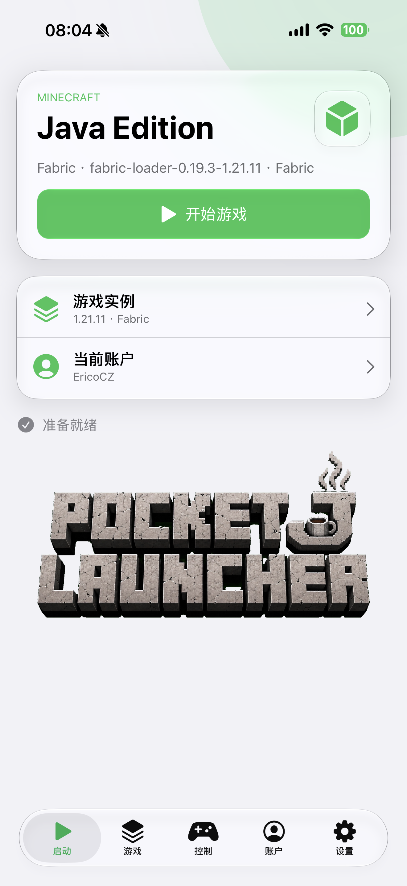</a> | _启动器主页_  _Launcher Home_ |
| <a href="iOS27测试/IMG_0089.PNG">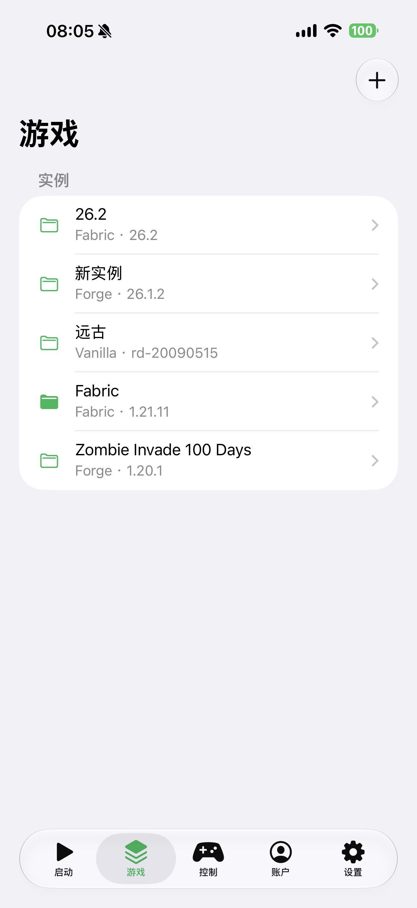</a> | _实例管理界面_  _Instance Management Interface_ |
| <a href="iOS27测试/IMG_0090.PNG">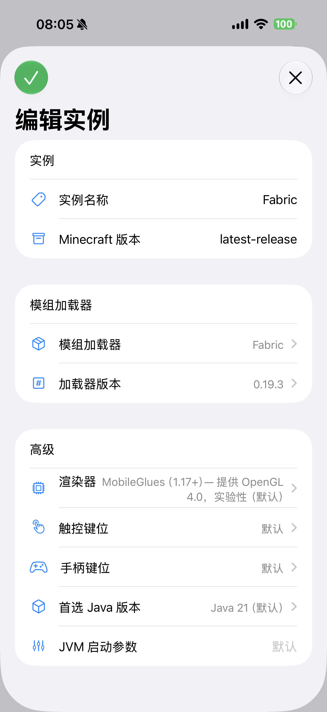</a> | _实例编辑界面_  _Instance Editing Interface_ |
| <a href="iOS27测试/IMG_0091.PNG">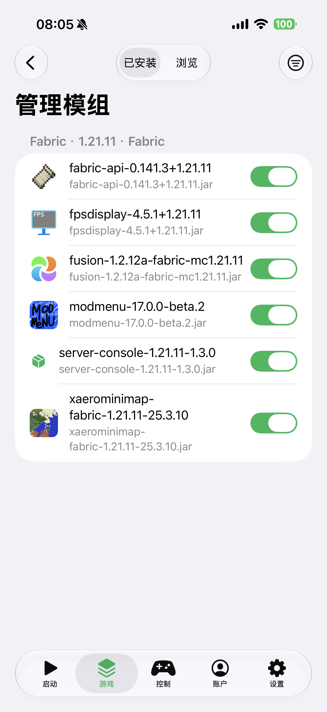</a> | _已安装模组管理界面_  _Installed Mods Management Interface_ |
| <a href="iOS27测试/IMG_0092.PNG">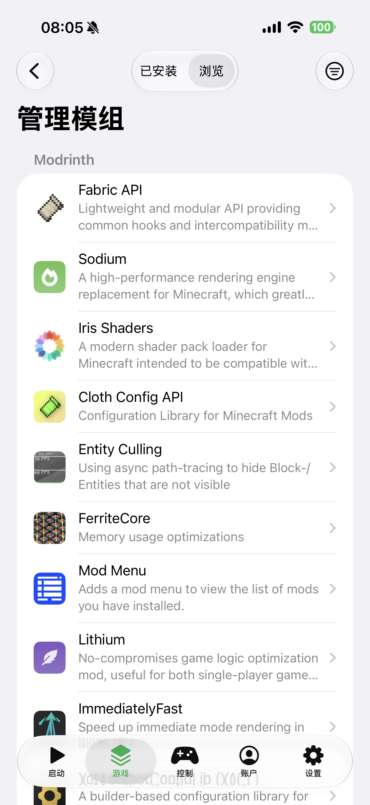</a> | _下载模组界面_  _Download Mods Interface_ |
| <a href="iOS27测试/IMG_0093.PNG">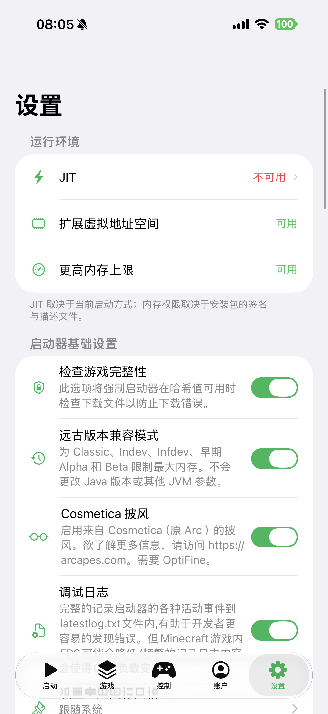</a> | _设置界面_  _Settings Interface_ |
| <a href="iOS27测试/IMG_0094.PNG">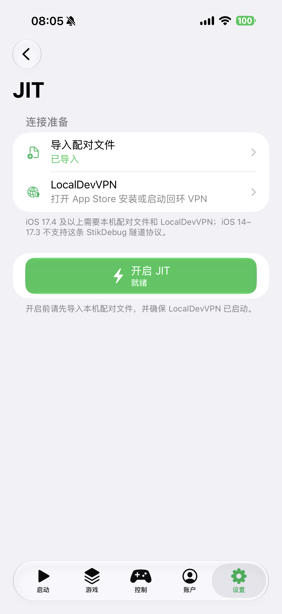</a> | _内置JIT启动器（iOS 17.4+ 可用）_  _Built-in JIT Launcher (Available on iOS 17.4+)_ |
| <a href="iOS27测试/IMG_0095.PNG">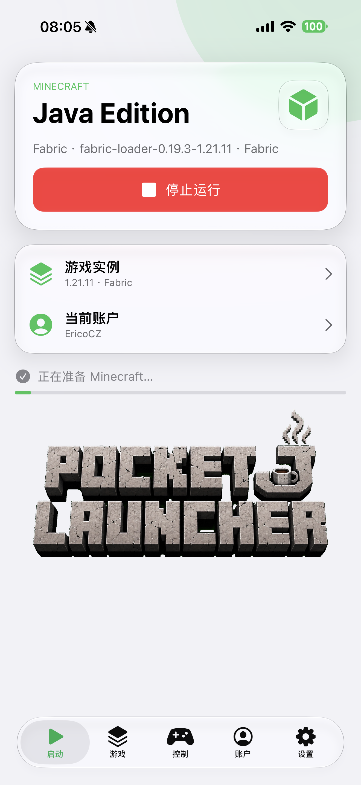</a> | _准备运行游戏_  _Preparing to Launch Game_ |
| <a href="iOS27测试/IMG_0096.PNG">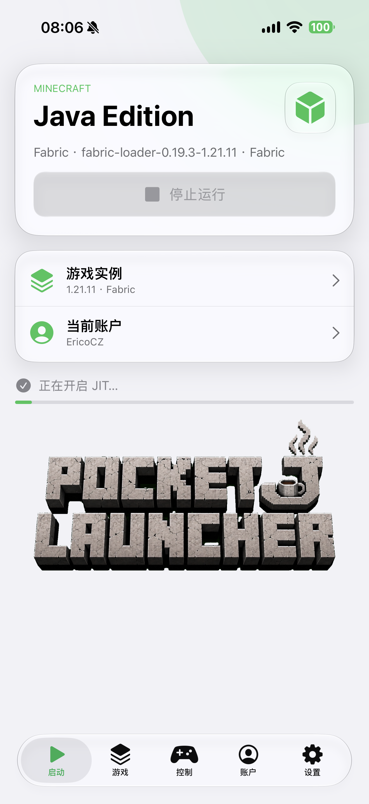</a> | _自动开启JIT_  _Auto-enable JIT_ |
| <a href="iOS27测试/IMG_0097.PNG">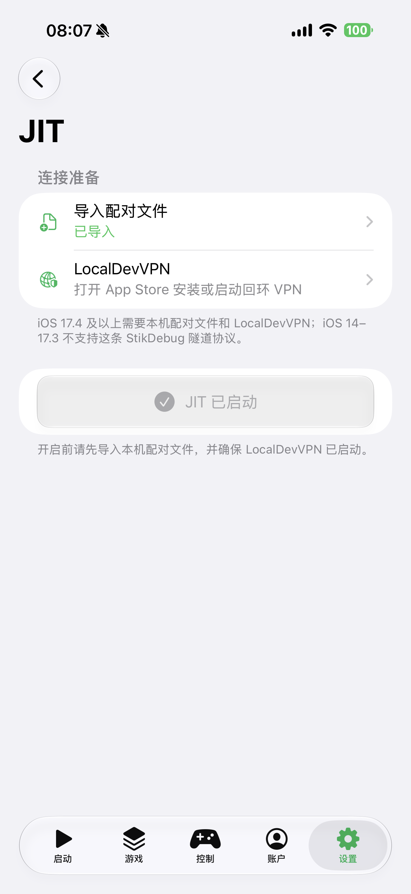</a> | _JIT成功开启提示_  _JIT Successfully Enabled Notification_ |
| <a href="iOS27测试/IMG_0098.PNG">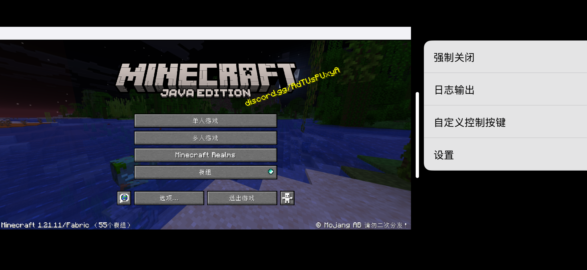</a> | _游戏内操作界面（从屏幕最右侧 向左滑动）_  _In-Game Control Interface (Swipe from Right Edge to Left)_ |
| <a href="iOS27测试/IMG_0099.PNG">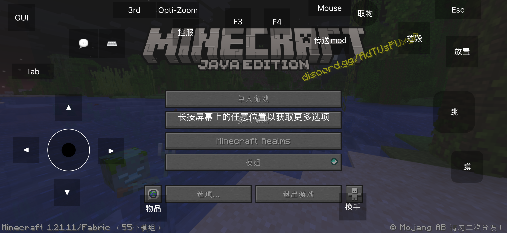</a> | _键位调整界面_  _Key Mapping Interface_ |
| <a href="iOS27测试/IMG_0100.PNG">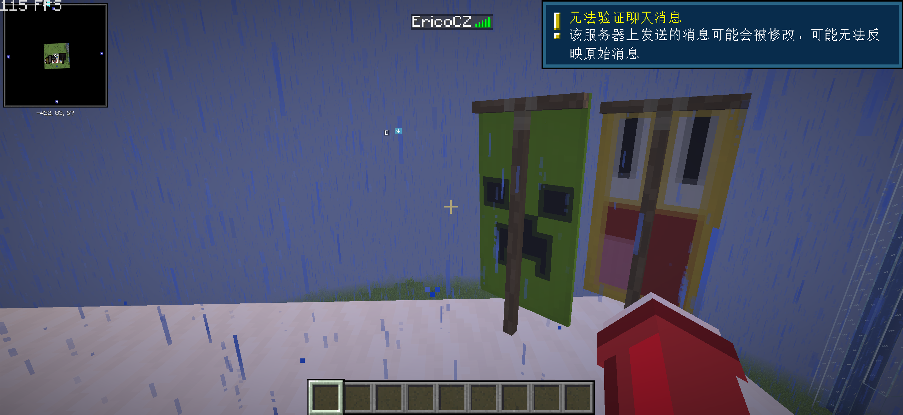</a> | _可连接在线服务器_  _Online Server Connection_ |

<a href="#选择要查看的内容">返回目录 ↑</a>

<strong>iPadOS 18 测试 · 3 张截图</strong>

 

| 预览 | 截图说明 |
|:---:|---|
| <a href="iPadOS18测试/IMG_6676.PNG">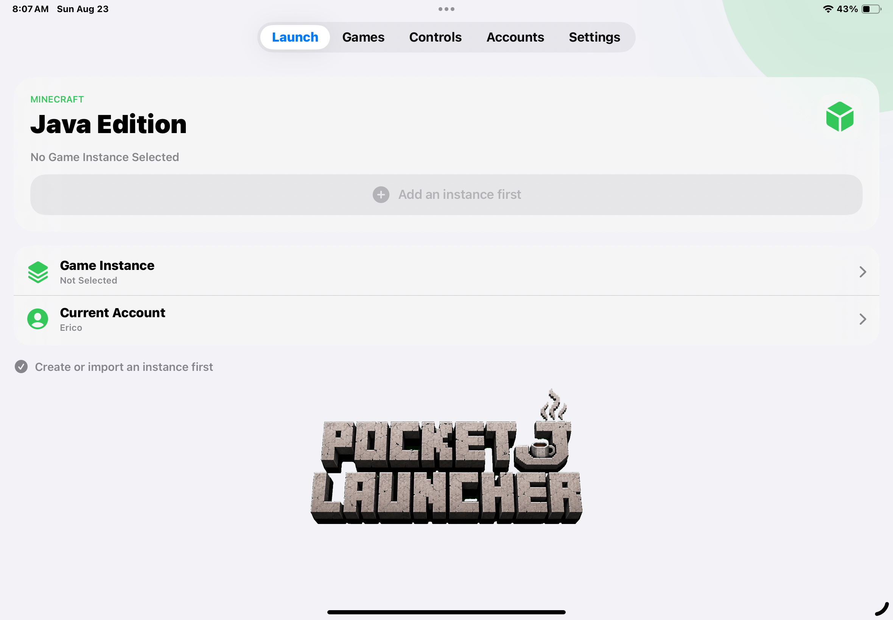</a> | _启动器主页_  _Launcher Home_ |
| <a href="iPadOS18测试/IMG_6677.PNG">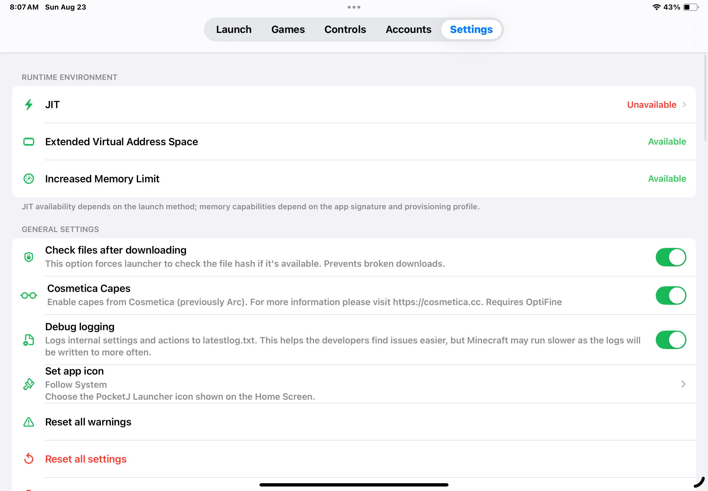</a> | _设置界面_  _Settings Interface_ |
| <a href="iPadOS18测试/IMG_6678.PNG">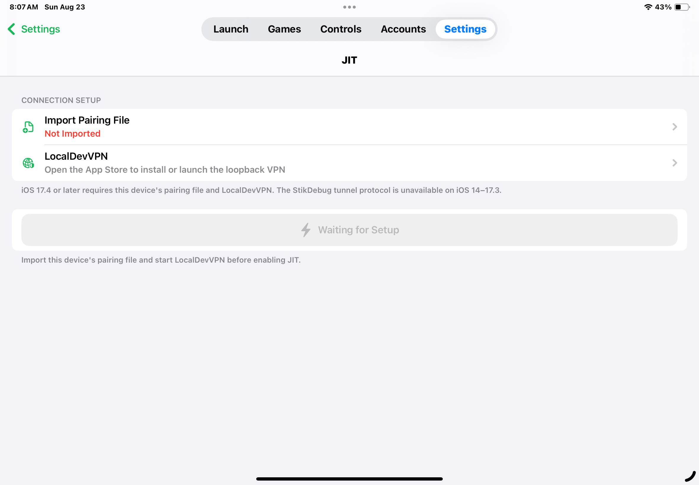</a> | _内置JIT启动器（未导入配对文件状态）_  _Built-in JIT Launcher (Pairing File Not Imported)_ |

<a href="#选择要查看的内容">返回目录 ↑</a>

<strong>iPhone X 与 iOS 14 测试 · 4 张截图</strong>

 

| 预览 | 截图说明 |
|:---:|---|
|  | _巨魔商店安装tipa版本（常驻开启JIT）_  _Troll Store tipa Installation (JIT Permanently Enabled)_ |
|  | _启动器主页_  _Launcher Home_ |
|  | _设置界面_  _Settings Interface_ |
|  | _内置JIT启动器（iOS系统版本不支持状态）_  _Built-in JIT Launcher (iOS System Version Not Supported)_ |

<a href="#选择要查看的内容">返回目录 ↑</a>

<strong>Forge 测试 · 3 张截图</strong>

 

> [!NOTE]
> 这里保留的是早期 Forge 安装与启动测试截图；v1.3 已将 Forge 纳入统一加载器版本流程。

| 预览 | 截图说明 |
|:---:|---|
| <a href="测试forge/IMG_0068.PNG">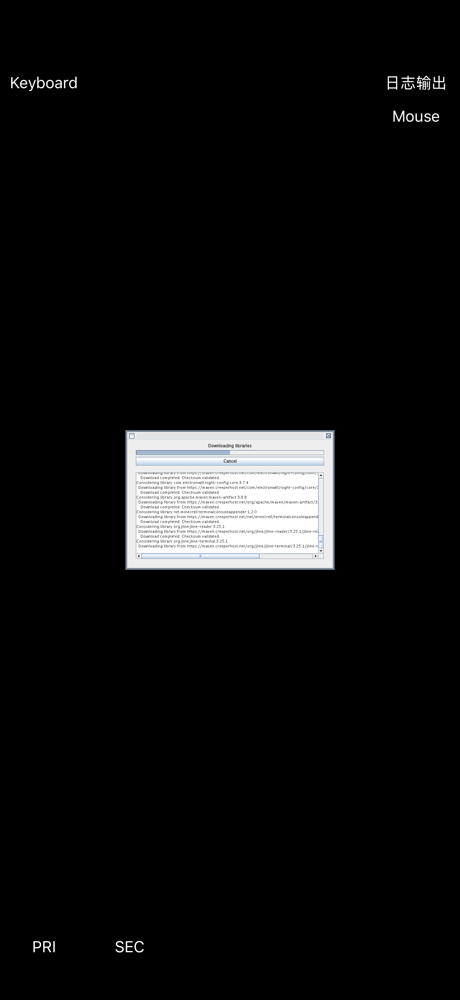</a> | _forge安装器_  _Forge Installer_ |
| <a href="测试forge/IMG_0069.PNG">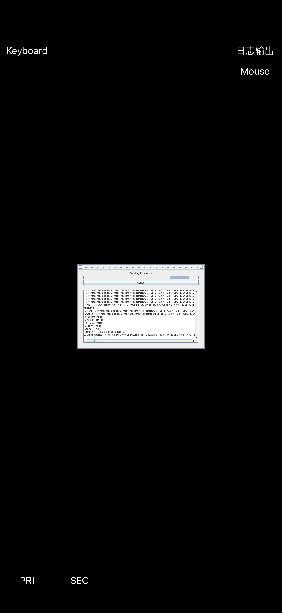</a> | _forge安装器_  _Forge Installer_ |
| <a href="测试forge/IMG_0070.PNG">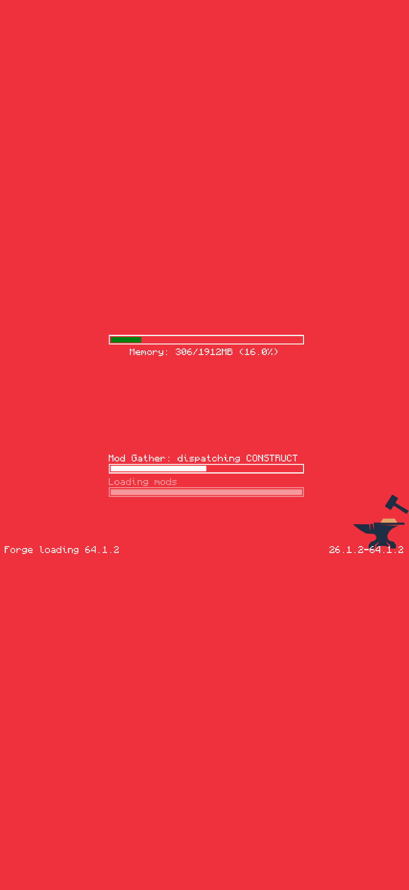</a> | _forge启动界面_  _Forge Launch Interface_ |

<a href="#选择要查看的内容">返回目录 ↑</a>

---

# 🇬🇧 English

## Choose a gallery

> [!NOTE]
> The current screenshots show the **Simplified Chinese** edition of PocketJ Launcher. English-language preview screenshots will be added in a future update.

The gallery structure and captions are bilingual:

- [v1.3 update gallery](#v13-gallery) — custom backgrounds, Minecraft 26.x rendering, and online resources
- [iOS 27 testing](#ios-27-gallery) — current iPhone UI and primary features
- [iPadOS 18 testing](#ipados-18-gallery) — iPad layout and large-screen adaptation
- [iPhone X and iOS 14 testing](#iphone-x-ios-14-gallery) — older-device, minimum-OS, and landscape compatibility
- [Forge testing](#forge-gallery) — archived early Forge installation and launch testing

<a href="../README.md">← 返回 PocketJ Launcher 主项目 / Back to PocketJ Launcher</a>

